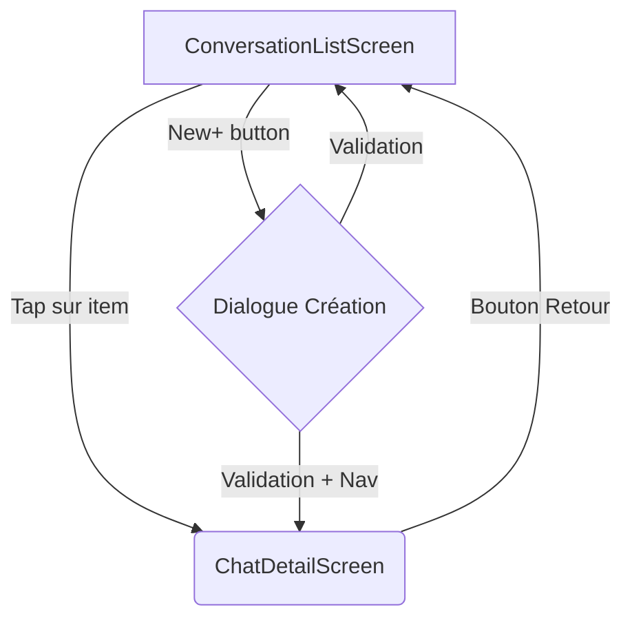
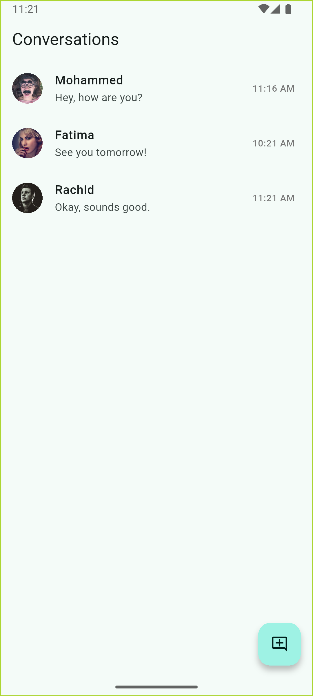
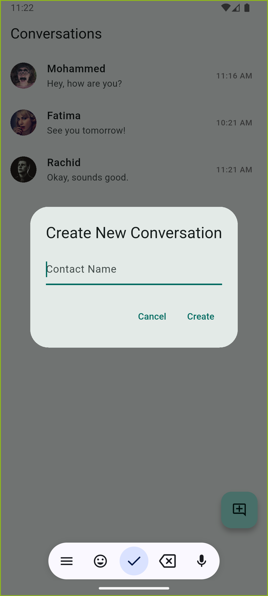
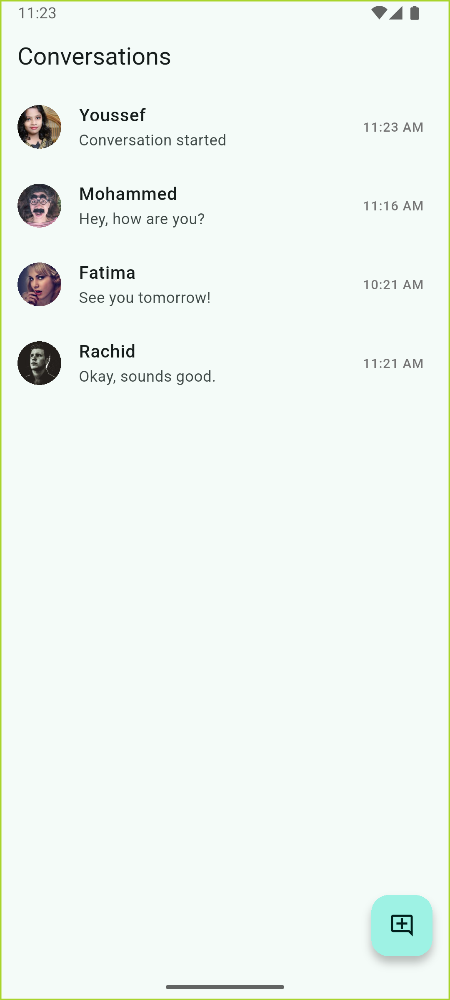
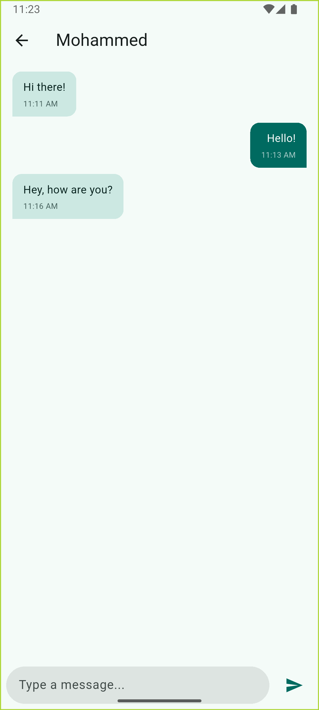
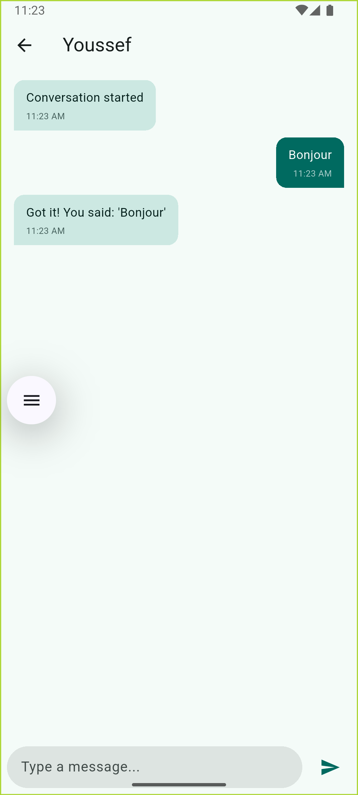
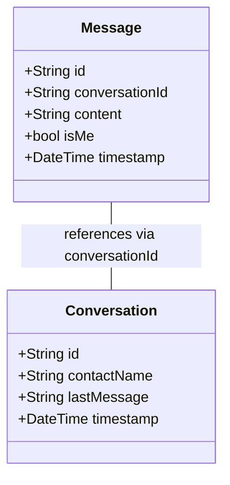

# exam_flutter

## Compte Rendu – Examen : Application de Chat Flutter/BLoC

| **Nom et Prenom** | **Filiere** |
|---|---|
| Amazzal Youssef | GLSID 2 |

### Introduction
Le présent document détaille la réalisation d'une application de chat mobile développée avec le framework Flutter. L'objectif principal était de mettre en œuvre une gestion d'état robuste via le pattern BLoC (Business Logic Component) et de simuler les fonctionnalités de base d'une messagerie, incluant une liste de conversations et une vue détaillée pour chaque échange. Les données de l'application sont simulées pour se concentrer sur l'architecture et l'interface utilisateur.

## 1. Architecture BLoC (Business Logic Component)

Pour la gestion de l'état, le choix s'est porté sur l'utilisation d'un unique `ConversationBloc`. Cette décision a été prise pour simplifier la synchronisation des données entre la liste des conversations (qui doit refléter le dernier message et le statut "non lu") et la vue de détail où les messages sont envoyés et reçus. Dans le contexte de données simulées et d'un périmètre fonctionnel défini, cette approche centralisée s'est avérée plus directe que la gestion de multiples BLoCs interconnectés.

### États (`ConversationState`)
L'état global de l'application géré par le `ConversationBloc` est encapsulé dans l'objet `ConversationState`. Cet état est immutable et hérite d'`Equatable` pour des reconstructions d'UI optimisées. Il comprend :

*   `conversations`: Une `List<Conversation>` contenant toutes les discussions.
*   `conversationListStatus`: Un `enum DataStatus` (initial, loading, success, failure) indiquant l'état du chargement de la liste des conversations.
*   `activeConversationMessages`: Une `List<Message>` pour les messages de la conversation actuellement ouverte.
*   `activeConversationId`: L'identifiant `String?` de la conversation sélectionnée.
*   `messageListStatus`: Un `enum DataStatus` pour l'état de chargement des messages de la conversation active.
*   `sendMessageStatus`: Un `enum DataStatus` pour l'état de l'envoi d'un message.
*   `error`: Un `String?` pour stocker un message d'erreur éventuel.

### Événements (`ConversationEvent`)
Conformément aux exigences, les événements se limitent à trois types principaux, mais chacun a été enrichi pour supporter des fonctionnalités étendues :

| Événement | Description |
| :-------- | :---------- |
| `LoadConversations` | Sert à la fois pour charger toutes les conversations (sans paramètre) et pour sélectionner une conversation spécifique (avec conversationId et option markAsRead). |
| `SendMessage` | Déclenche l'envoi d'un message avec le contenu fourni dans la conversation spécifiée. |
| `ReceiveMessage` | Simule la réception d'un message, et peut également servir à créer une nouvelle conversation lorsque le paramètre contactName est fourni. |

Cette simplification des événements permet une architecture plus élégante tout en préservant toutes les fonctionnalités requises.

## 2. Séparation des Préoccupations et Gestion des Détails UI

Pour respecter strictement les modèles de données spécifiés (`Conversation` et `Message`) qui ne contiennent que les champs essentiels, nous avons implémenté une solution élégante pour gérer les détails UI supplémentaires :

1. Un `UIDetailsProvider`, implémenté comme un `InheritedWidget`, maintient les informations visuelles non essentielles comme les URLs des avatars et les compteurs de messages non lus.

2. Le `MockChatRepository` stocke également ces détails UI en arrière-plan, tout en préservant la pureté des modèles de données.

Cette approche assure que :
- Les modèles de données restent simples et alignés sur les spécifications
- L'interface utilisateur est riche et informative
- Le code reste modulaire et maintenable

## 3. Navigation entre les Écrans

La navigation au sein de l'application est gérée par le `Navigator` de Flutter, en utilisant un système de routes nommées défini dans la propriété `onGenerateRoute` du widget `MaterialApp`. Cela permet une gestion centralisée des transitions entre les écrans principaux : `ConversationListScreen` (l'écran d'accueil) et `ChatDetailScreen` (l'écran d'une conversation spécifique).

Le passage de la `ConversationListScreen` à la `ChatDetailScreen` s'effectue lorsqu'un utilisateur sélectionne une conversation. L'objet `Conversation` est passé en argument à la nouvelle route pour permettre à `ChatDetailScreen` d'afficher immédiatement des informations contextuelles (comme le nom du contact dans l'AppBar) pendant que le `ConversationBloc` charge les messages correspondants (déclenché par l'événement `ConversationSelected`).

La création d'une nouvelle conversation initie un dialogue modal depuis `ConversationListScreen`. Une fois le nom du contact soumis, l'événement `CreateNewConversationRequested` est envoyé au BLoC. Après la création simulée, le BLoC met à jour son état, ce qui peut déclencher (via un `BlocListener`) une navigation automatique vers `ChatDetailScreen` pour la conversation nouvellement créée.

**Diagramme de Navigation :**

### Screenshots de la Navigation

## 4. Fonctionnalités Implémentées

L'application met en œuvre les fonctionnalités essentielles d'une application de messagerie, réparties sur deux écrans principaux.

### Écran Liste des conversations (`ConversationListScreen`)
Cet écran sert de point d'entrée et présente :
* Une liste dynamique des conversations. Chaque item affiche :
  * Un avatar (placeholder basé sur les initiales ou une image réseau si fournie).
  * Le nom du contact.
  * Le contenu du dernier message échangé (tronqué si nécessaire).
  * Le timestamp du dernier message.
* Un badge visuel indiquant le nombre de messages non lus pour chaque conversation pertinente.
* La possibilité de créer une nouvelle conversation via un `FloatingActionButton`, qui ouvre un dialogue pour saisir le nom du contact.
* La navigation vers `ChatDetailScreen` lors d'un appui sur une conversation.
* Un `RefreshIndicator` pour permettre le rechargement manuel de la liste.

<table>
  <tr>
    <td></td>
    <td></td>
  </tr>
  <tr>
    <td align="center"><em>Liste des conversations</em></td>
    <td align="center"><em>Dialogue de création d'une nouvelle conversation</em></td>
  </tr>
</table>

### Écran de conversation détaillée (`ChatDetailScreen`)
Cet écran est dédié à l'affichage et à l'interaction au sein d'une conversation unique :
* Affichage chronologique des messages de la conversation sélectionnée.
* Différenciation visuelle claire des messages :
  * Messages envoyés par l'utilisateur (`isMe: true`) : alignés à droite, avec une couleur de bulle spécifique.
  * Messages reçus du contact (`isMe: false`) : alignés à gauche, avec une autre couleur de bulle.
* Affichage du contenu textuel et du timestamp pour chaque message.
* Un champ de saisie de texte (`TextField`) et un bouton d'envoi pour composer et expédier de nouveaux messages.
* Défilement automatique vers le message le plus récent lors de l'ouverture de l'écran ou de la réception/envoi d'un nouveau message.

<table>
  <tr>
    <td></td>
    <td></td>
  </tr>
  <tr>
    <td align="center"><em>Vue de conversation avec messages</em></td>
    <td align="center"><em>Champ de saisie avec bouton d'envoi</em></td>
  </tr>
</table>

## 5. Modèles de Données et Simulation
Les structures de données `Conversation` et `Message` ont été définies avec les champs requis et héritent de `Equatable` pour faciliter la gestion d'état et les comparaisons. La couche de données est simulée par `MockChatRepository`, qui retourne des données pré-définies avec des délais artificiels pour mimer des opérations asynchrones, permettant de tester l'UI et la logique du BLoC en l'absence d'un backend réel.

### Diagramme de Classes

### Explication du Diagramme de Classes

Le diagramme illustre les relations entre les composants principaux de l'application :

1. **Modèles de données** : 
   - `Conversation` et `Message` sont les entités principales, définies strictement selon les spécifications.
   - Ces modèles sont immuables et utilisent `Equatable` pour optimiser les comparaisons.